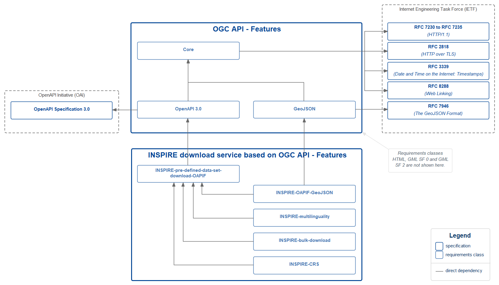

# Setting up an INSPIRE Download service based on the OGC API-Features standard

`Version: 1.0`
`Date: 2021-02-05`

## Table of Contents

* [1. Introduction](#introduction)
* [2. Scope](#scope)
* [3. Conformance](#conformance)
* [4. Normative references](#normative-references)
* [5. Terms and definitions](#terms-and-definitions)
* [6. Symbols and abbreviated terms](#symbols-and-abbreviated-terms)
* [7. INSPIRE Download Services based on OAPIF](#inspire-oapif)
    * [7.1. Main principles](#main-principles)
    * [7.2. OAPIF Resources](#resources)
* [8. Requirements classes](#req-classes)
    * [8.1. Requirements class  “INSPIRE-pre-defined-data-set-download-OAPIF”](#req-pre-defined)
    * [8.2. Requirements class “INSPIRE-multilinguality”](#req-multilinguality)
    * [8.3. Requirements class “INSPIRE-OAPIF-GeoJSON”](#req-oapif-json)
    * [8.4. Requirements class "INSPIRE-bulk-download"](#req-bulk-download)
    * [8.5. Requirements class "INSPIRE-CRS"](#req-crs)    
* [9. Example](#example)
* [10. Bibliography](#bibliography)
* [Annex A: Abstract Test Suite](#ats)
* [Annex B: Mapping the requirements from the IRs to the OGC  API - Features standard (and extensions)](#ir2oapif)
* [Annex C: Mapping between INSPIRE Network services metadata and OpenAPI definitions](#inspire-ns-openapi)
* [Annex D: Supported languages](#supported-lang)

## 1. Introduction <a name="introduction"></a>

This document proposes a technical approach for implementing the requirements set out in the [INSPIRE Implementing Rules for download services](http://data.europa.eu/eli/reg/2009/976/oj) based on the newly adopted [OGC API - Features standard](http://docs.opengeospatial.org/is/17-069r3/17-069r3.html).

Several possible solutions for implementing download services are already endorsed by the INSPIRE Maintenance and Implementation (MIG) group. [Technical guidelines documents](https://inspire.ec.europa.eu/Technical-Guidelines2/Network-Services/41) are available that cover implementations based on ATOM, WFS 2.0, WCS and SOS.

While all of these approaches use the Web for providing access to geospatial data, the new family of OGC API standards aim to be more developer friendly by requiring less up-front knowledge of the standard involved. The rapid emergence of Web APIs provide a flexible and easily understandable means for access to data, as recommended by the W3C Data on the Web Best Practices [DWBP Best Practice 23](https://www.w3.org/TR/dwbp/#accessAPIs) and [DWBP Best Practice 24](https://www.w3.org/TR/dwbp/#APIHttpVerbs).

Therefore, this document describes an additional option for the implementation of INSPIRE download services.

In order to facilitate the use of off-the-shelf software implementing the OGC API - Features standard (OAPIF) to meet the requirements in this document, INSPIRE-specific extensions are limited to the absolute minimum. Where several implementation options exist, this document describes the specific way of application of the OAPIF and associated standards to meet the requirements of the INSPIRE Implementing Rules for download services.

### OGC API - Features - a brief overview

OGC API standards define modular API parts that spatially enable Web APIs in a consistent way. The [OpenAPI specification](http://docs.opengeospatial.org/is/17-069r3/17-069r3.html#OpenAPI) is used to define the API building blocks.

OGC API - Features provides API building blocks to create, modify and query features on the Web. OGC API - Features is comprised of multiple parts, each of them is a separate standard. The ["Core"](http://docs.opengeospatial.org/is/17-069r3/17-069r3.html) part specifies the core capabilities and is restricted to retrieving features where geometries are represented in the WGS 84 coordinate reference system with axis order longitude/latitude. Additional capabilities that address more advanced needs will be specified in additional parts. A [roadmap](https://www.opengeospatial.org/roadmap) is made available by the OGC.

By default, every API implementing this standard will provide access to a single data set. Rather than sharing the data as a complete data set, the OGC API - Features standards offer direct, fine-grained access to the data at the feature (object) level. Query operations enable clients to retrieve features from the underlying data store based upon simple selection criteria, defined by the client.

For further details about the standard, see the official [OGC API - Features website](https://www.opengeospatial.org/standards/ogcapi-features).

For a description of the main differences between WFS 2.0 and OGC API - Features, see [this section in the Guide on OGC API - Features](https://github.com/opengeospatial/ogcapi-features/blob/master/guide/section_8_WFS_2_0_v_3_0.adoc).

## 2. Scope <a name="scope"></a>

This document proposes a technical approach for implementing the requirements set out in the [INSPIRE Implementing Rules for download services](http://data.europa.eu/eli/reg/2009/976/oj) based on the [OGC API - Features standard](http://docs.opengeospatial.org/is/17-069r3/17-069r3.html). The approach described here is not legally binding and shows one of several ways of implementing INSPIRE Download services.

## 3. Conformance <a name="conformance"></a>

This specification defines the following requirements classes:

- [INSPIRE-pre-defined-data-set-download-OAPIF (mandatory)](#req-pre-defined)
- [INSPIRE-multilinguality (conditional)<sup> 1</sup>](#req-multilinguality)
- [INSPIRE-OAPIF-GeoJSON (optional)](#req-oapif-json)
- [INSPIRE-bulk-download (optional)](#req-bulk-download)

<sup>1 </sup>The INSPIRE-multilinguality requirements class is mandatory for all data sets that contain information in more than one natural language.

The requirements classes and their dependencies are illustrated in the figure below.



Future versions of this specification may include further conformance classes, in particular for
- direct access download, and
- quality of service

The target of all requirements classes are “Web APIs”. Conformance with this specification shall be assessed using all the relevant conformance test cases specified in [Annex A (normative)](#ats) of this specification.

## 4. Normative references <a name="normative-references"></a>

- **[ISO 19115-2:2019](https://schemas.isotc211.org/schemas/19115/-2/gmi/1.0/gmi.xsd)** - ISO 19115-2:2019, *Geographic information — Metadata — Part 2: Extensions for acquisition and processing*
- **[ISO/TS 19139:2007](https://www.isotc211.org/2005/gmd/)** - ISO/TS 19139:2007, *Geographic information — Metadata — XML schema implementation*
- **[OGC API - Features - 1]** - OGC API - Features - Part 1: Core<sup> 2</sup>
- **[OGC API - Features - 2]** - OGC API - Features - Part 2: Coordinate Reference Systems by Reference
- **[OpenAPI 3.0]** - OpenAPI Initiative (OAI). *OpenAPI Specification*. The latest patch version at the time of publication of this document was 3.0.3, published in February 2020.
- **[IRs for NS]** - Commission Regulation (EC) No 976/2009 of 19 October 2009 implementing Directive 2007/2/EC of the European Parliament and of the Council as regards the Network Services
- **[IRs for ISDSS]** - Commission Regulation (EU) No 1089/2010 of 23 November 2010 implementing Directive 2007/2/EC of the European Parliament and of the Council as regards interoperability of spatial data sets and services
- **[RFC 4647]** - Internet Engineering Task Force (IETF). RFC 4647, *Matching of Language Tags*. September 2006
- **[RFC 5646]** - Internet Engineering Task Force (IETF). RFC 5646, *Tags for Identifying Languages*. September 2009
- **[RFC 7231]** - Internet Engineering Task Force (IETF). RFC 7231, *Hypertext Transfer Protocol (HTTP/1.1): Semantics and Content*. June 2014
- **[RSS 2.0](http://www.rssboard.org/rss-draft-1)** - Really Simple Syndication Specification (RSS 2.0) Specification

<sup>2 </sup> The standard is also published as [ISO 19168-1:2020, Geographic information — Geospatial API for features — Part 1: Core](https://www.iso.org/standard/32586.html). Note that a [draft version 1.0.1](http://docs.opengeospatial.org/DRAFTS/17-069r4.html) is available, see the included issues on https://github.com/opengeospatial/ogcapi-features/milestone/4?closed=1.

<!-- Second parts of the reference-style links, see also https://www.markdownguide.org/basic-syntax/#reference-style-links  -->
[IRs for NS]: https://eur-lex.europa.eu/legal-content/EN/TXT/?uri=CELEX%3A02009R0976-20141231 "Implementing Rules for Network Services (consolidated version of 31/12/2014)"
[IRs for ISDSS]: https://eur-lex.europa.eu/legal-content/EN/TXT/?uri=CELEX%3A02010R1089-20141231 "Implementing Rules for interoperability of spatial data sets and services (consolidated version of 31/12/2014)"
[OGC API - Features - 1]: http://docs.opengeospatial.org/is/17-069r3/17-069r3.html "OGC API - Features - Part 1: Core"
[OGC API - Features - 2]: http://docs.opengeospatial.org/is/18-058/18-058.html "OGC API - Features - Part 2: Coordinate Reference Systems by Reference"
[OpenAPI 3.0]: http://spec.openapis.org/oas/v3.0.3 "OpenAPI Specification 3.0"
[RFC 4647]: https://www.rfc-editor.org/rfc/rfc4647 "Matching of Language Tags"
[RFC 5646]: https://www.rfc-editor.org/rfc/rfc5646 "Tags for Identifying Languages"
[RFC 7231]: https://www.rfc-editor.org/rfc/rfc7231 "HTTP/1.1: Semantics and Content"

## 5. Terms and definitions <a name="terms-and-definitions"></a>

For the purposes of this document, the following terms and definitions apply:

| Term | Definition | Source |
| --- | --- | --- |
| content negotiation | The practice of providing multiple representations available via the same URI | [ISO/IEC 19788](https://www.iso.org/obp/ui/#iso:std:iso-iec:19788:-7:ed-1:v1:en:sec:3.20) |
| data set | Identifiable collection of data. | [ISO 19115](https://www.iso.org/obp/ui/#iso:std:iso:19115:-2:ed-2:v1:en:sec:3.6) |
| distribution (of a data set) | A specific representation of a data set. A data set might be available in multiple serializations that may differ in various ways, including natural language, media-type or format, schematic organization, temporal and spatial resolution, level of detail or profiles (which might specify any or all of the above). | [DCAT](https://www.w3.org/TR/vocab-dcat-2/#Class:Distribution) |
| direct access download service | Download Service which provides access to the Spatial Objects in Spatial Data Sets based upon a query | [IRs for NS](https://eur-lex.europa.eu/legal-content/EN/TXT/HTML/?uri=CELEX:32010R1088&from=EN) |
| encoding | Conversion of data into a series of codes. | [ISO 19118](https://www.iso.org/obp/ui/#iso:std:iso:19118:ed-2:v1:en:term:4.13) |
| encoding rule | Identifiable collection of conversion rules that define the encoding for a particular data structure. | [ISO 19118](https://www.iso.org/obp/ui/#iso:std:iso:19118:ed-2:v1:en:term:4.14) |
| feature | Abstraction of real world phenomena. **NOTE** The concept of a `feature` is synonymous to a `spatial object` in INSPIRE | [OGC API - Features - 1](http://docs.opengeospatial.org/is/17-069r3/17-069r3.html#_feature) |
| feature collection | A set of features from a data set. | [OGC API - Features - 1](http://docs.opengeospatial.org/is/17-069r3/17-069r3.html#_feature_collection) |
| feature type | **NOTE** The concept of a `feature type` is synonymous to a `spatial object type` in INSPIRE | [INSPIRE](https://inspire.ec.europa.eu/glossary/SpatialObject) |
| pre-defined data set download service | Service that enables copies of spatial data sets, or parts of such sets, to be downloaded. | [IRs for NS](https://eur-lex.europa.eu/legal-content/EN/TXT/HTML/?uri=CELEX:02009R0976-20101228&from=EN) |
| Web API | API using an architectural style that is founded on the technologies of the Web. | [DWBP](https://www.w3.org/TR/dwbp) |


**NOTE** ISO and the European Commission maintain comprehensive terminological databases at the following addresses:
- [ISO Online browsing platform](https://www.iso.org/obp)
- [INSPIRE glossary](http://inspire.ec.europa.eu/glossary)

## 6. Symbols and abbreviated terms <a name="symbols-and-abbreviated-terms"></a>

| Abbreviation | Term |
| --- | --- |
| API |    Application Programming Interface |
| CRS | Coordinate Reference System |
| DCAT | Data Catalog Vocabulary |
| GML | Geography Markup Language |
| JSON | JavaScript Object Notation |
| OAPIF | OGC API - Features |
| URL |    Uniform Resource Locator |
| WFS | Web Feature Service |

## 7. INSPIRE Download Services based on OAPIF <a name="inspire-oapif"></a>

This section describes the requirements a Web API shall fulfill in order to be compliant with both ‘OGC API – Features’ and INSPIRE requirements for download services.

### 7.1. Main principles <a name="main-principles"></a>

- A Web API provides data from one data set. This means that one data publisher often will need to provide more than one Web API.
- The exact composition of a data set is determined by the data publisher. It may be that the data set contains all that publishers’ information on one INSPIRE theme, but other compositions are allowed.
- A data set is structured into one or several feature collections. Аll feature collections available in one API (under the `/collections` path) are considered to be part of the data set provided by that Web API.
- A feature collection contains features of only one feature type.

For example, two data sets (with their own metadata records), one on buildings and one on addresses will have two landing pages (https://developer.my-org.eu/apis/addresses/ and https://developer.my-org.eu/apis/buildings/) rather than one landing page for the Web API (https://developer.my-org.eu/apis/oapif/) and two feature collections, one for each data set (https://developer.my-org.eu/apis/oapif/collections/addresses and https://developer.my-org.eu/apis/oapif/collections/buildings).

The mapping between INSPIRE resources and OAPIF resources is given below, for an example data set containing addresses.

| INSPIRE resource | OAPIF resource | Sample path | Document reference |
| ------------- | ------------- | ------------- |-------------: |
| (Distribution<sup> 3</sup> of a) data set | Landing page | https://developer.my-org.eu/apis/addresses/ | [OAPIF 7.2 API landing page](http://docs.opengeospatial.org/is/17-069r3/17-069r3.html#_api_landing_page) |
| Data set metadata | Feature collections | https://developer.my-org.eu/apis/addresses/collections/ | [OAPIF 7.13 Feature collections](http://docs.opengeospatial.org/is/17-069r3/17-069r3.html#_collections_) |
| -- | Feature collection | https://developer.my-org.eu/apis/addresses/collections/address | [OAPIF 7.14 Feature collection](http://docs.opengeospatial.org/is/17-069r3/17-069r3.html#_collection_) |
| Spatial objects | Features | https://developer.my-org.eu/apis/addresses/collections/address/items | [OAPIF 7.15 Features](http://docs.opengeospatial.org/is/17-069r3/17-069r3.html#_items_) |
| Spatial object | Feature | https://developer.my-org.eu/apis/addresses/collections/address/items/{featureId} | [OAPIF 7.16 Feature](http://docs.opengeospatial.org/is/17-069r3/17-069r3.html#_feature_) |

<sup>3 </sup>The notion of a distribution is not present in the INSPIRE legislation, the legislation does not make the distinction between a data set and its distribution(s). However, this distinction is relevant, see also section 4 in \[DWBP\].

The principle that a Web API provides data from one data set is in line with OGC API - Features - Part 1: Core, as illustrated by the quotes below. As long as no other parts for OGC API - Features are defined that support multiple datasets, INSPIRE adheres to this principle.

> By default, every API implementing this standard will provide access to a single dataset.

> A server that implements this conformance class provides access to the features in a dataset. In other words, the API is a distribution of that dataset. A file download, for example, would be another distribution.

### 7.2. Resources <a name="resources"></a>

The figures below illustrate the resources defined by OGC API – Features, and links to external resources that are required by the depicted requirements classes, including the link relation types to be used.


## 8. Requirements classes <a name="req-classes"></a>
 
### 8.1. Requirements class “INSPIRE-pre-defined-data-set-download-OAPIF”  <a name="req-pre-defined"></a>

| Requirements class | http://inspire.ec.europa.eu/id/spec/oapif-download/1.0/req/pre-defined |
| --- | --- |
| Target type | Web API |
| Dependency | [OAPIF Requirements class "OpenAPI 3.0"](http://docs.opengeospatial.org/is/17-069r3/17-069r3.html#_requirements_class_openapi_3_0) |

The Web API depends on the [OAPIF Requirements class OpenAPI 3.0](http://docs.opengeospatial.org/is/17-069r3/17-069r3.html#_requirements_class_openapi_3_0), and therefore also on the [OAPIF Requirements class Core](http://docs.opengeospatial.org/is/17-069r3/17-069r3.html#_requirements_class_core), for providing access to INSPIRE data.

**NOTE 1** The Web API shall return collections and features in the default OAPIF coordinate reference system (WGS 84 longitude and latitude). However, the `enclosure` link for bulk download could still provide access to a data set in a different CRS.

**NOTE 2** In the OAPIF standard, the [OpenAPI 3.0 Requirements class](http://docs.opengeospatial.org/is/17-069r3/17-069r3.html#_requirements_class_openapi_3_0) is optional. This specification proposes to make it a mandatory requirement for INSPIRE in order to facilitate the development of client applications, and in particular adding support in the [European INSPIRE geoportal](https://inspire-geoportal.ec.europa.eu). That is why, the Web API SHALL comply with OAPIF requirements class OpenAPI 3.0.


**NOTE 3** In accordance with the security requirements of the [OpenAPI 3.0 Requirements class](http://docs.opengeospatial.org/is/17-069r3/17-069r3.html#security), for cases where the operations of the server are access-controlled, the security scheme(s) SHALL be documented in the OpenAPI definition.

**NOTE 4** There are plans to add additional requirements classes for other API description standards (or standard versions) in the future (e.g. for OpenAPI v3.1). When additional requirements classes become available, this specification will be reviewed and possibly revised to include these as additional options.

**NOTE 5** For cases where data sets are too big for retrieval with a single API request, using multiple requests following the `next` links (paging) [TODO: add link that explains paging] is considered to meet the requirements for a download service. This will also help to support frequently updated data sets.

**NOTE 6** To support browser-based applications accessing the API directly, it is common practice to support [cross-origin requests](http://www.opengis.net/doc/IS/ogcapi-features-1/1.0#cross_origin).


#### Metadata elements of the data set

| **Requirement** | **/req/pre-defined/spatial-data-set-metadata** |
| --- | --- |
| A | The response of the `/collections` operation SHALL include a link to the metadata record for the data set. This link SHALL have `rel` link parameter `describedby` and `type` link parameter `application/xml`. |

**NOTE** This is an enforcement of recommendation [http://www.opengis.net/spec/ogcapi-features-1/1.0/rec/core/fc-md-descriptions](http://docs.opengeospatial.org/is/17-069r3/17-069r3.html#rec_core_fc-md-descriptions) in [OGC API - Features - 1] for the metadata record.

The data set metadata record must be available in the relevant national geoportal (see https://inspire.ec.europa.eu/INSPIRE-in-your-Country), must be harvested by the [INSPIRE Geoportal](https://inspire-geoportal.ec.europa.eu) and must be INSPIRE-compliant. However, this is out of scope for this specification. Note that often the person responsible for the metadata is not the same as the person responsible for the Web API.

**TEST**
1. Issue an HTTP GET request to {root}/collections.
2. Validate that at least one of the links returned in the response has `rel` link parameter `describedby` and `type` link parameter `application/xml`.
3. For each of the links returned in the response having a `rel` link parameter `describedby` and `type` link parameter `application/xml`, issue an HTTP HEAD request to the path given in the `href` link parameter of that link.
4. Validate that for one of the responses the returned XML document satisfies one of the following:
    - The document has root element `{http://www.opengis.net/cat/csw/2.0.2}GetRecordByIdResponse` followed by element `{http://www.isotc211.org/2005/gmd}MD_Metadata`.
    - The document has root element `{http://www.isotc211.org/2005/gmd}MD_Metadata`.
    - The document has root element `{http://standards.iso.org/iso/19115/-2/gmi/1.0}MI_Metadata`.

| **Recommendation** | **/rec/pre-defined/spatial-data-set-metadata-html** |
| --- | --- |
| A | If the API implements the HTML requirements class, the response of the `/collections` operation SHOULD include a link to the metadata record for the data set with `rel` link parameter `describedby` and `type` link parameter `text/html`. |


**NOTE** If the data set is available in GML, the link to the GML application schema of the data set will also have `rel` link parameter `describedby` and `type` link parameter `application/xml`.

#### Organisation of a data set in feature collections

| **Requirement** | **/req/pre-defined/spatial-object-type** |
| --- | --- |
| A | Every collection SHALL contain features of only one feature type
 
**NOTE** According to the OAPIF standard a collection could also contain more than one feature type.
 
**TEST**
1. Manual check for every collection, that all its features belong to the same feature type.

| **Requirement** | **/req/pre-defined/feature-concept-dictionary** |
| --- | --- |
| A | For each `collection` that provides data that is harmonised according to the [IRs for ISDSS](https://eur-lex.europa.eu/legal-content/EN/TXT/?uri=celex:32010R1089), a link with the link relation type `tag` to the corresponding entry in the [INSPIRE feature concept dictionary](https://inspire.ec.europa.eu/featureconcept) SHALL be included.

| **Recommendation** | **/rec/pre-defined/collection-naming** |
| --- | --- |
| A | For each `collection` that provides data that is harmonised according to the [IRs for ISDSS](https://eur-lex.europa.eu/legal-content/EN/TXT/?uri=celex:32010R1089), the id of the collection SHOULD be the lowercase version of the language-neutral name of the feature type as specified in the [IRs for ISDSS](https://eur-lex.europa.eu/legal-content/EN/TXT/?uri=celex:32010R1089). | 


**TEST**
1. Check all collections for a valid link to the INSPIRE feature concept dictionary.
2. If no link is available - MANUAL TEST: Check that the collections have not yet been harmonised.

#### Terms of use

| **Requirement** | **/req/pre-defined/licence** |
| --- | --- |
| A | The Web API SHALL contain a link to the licence of the data set in the `links` property of the response of the request to `/collections` (relation: `license`). |

**NOTE** This is an enforcement of subrecommendation B of recommendation http://www.opengis.net/spec/ogcapi-features-1/1.0/rec/core/fc-md-license in [OGC API - Features - 1].


**TEST**
1. Issue an HTTP GET request to `{root}/collections`.
2. Validate that at least one of the links returned in the response has `rel` link parameter `license`.
3. For each of the links returned in the response having a `rel` link parameter equal to `license`, issue an HTTP GET request to the path given in the `href` link parameter of that link.
4. For each of the responses, validate that the HTTP status code is 200.

| **Recommendation** | **/rec/pre-defined/license-openapi** |
| --- | --- |
| A | The licence information for the exposed data set SHOULD be provided in accordance with [OpenAPI 3.0]. |

**NOTE**: A proposal for mapping between INSPIRE NS Metadata elements and OpenAPI definition fields is available in [Annex C.](#inspire-ns-openapi)

### 8.2. Requirements class INSPIRE-multilinguality <a name="req-multilinguality"></a>

| Requirements class | http://inspire.ec.europa.eu/id/spec/oapif-download/1.0/req/multilinguality |
| --- | --- |
| Target type | Web API |
| Dependency | [INSPIRE-pre-defined-data-set-download-OAPIF](#req-pre-defined) |

This requirements class is mandatory for all data sets that contain information in more than one natural language.

The requirements from the \[[IRs for NS]\] to support requests in different natural languages are met in the Web API through HTTP language negotiation, using HTTP headers as specified in [RFC 7231], language tags as specified in [RFC 5646] and matching of language tags as specified in [RFC 4647].

| **Requirement** | **/req/multilinguality/accept-language-header** |
| --- | --- |
| A | The Web API SHALL support the `Accept-Language` HTTP header in requests to the landing page (`/`), `/collections`, `/collections/{collectionId}`, `/collections/{collectionId}/items` and `/collections/{collectionId}/items/{featureId}` in accordance with [RFC 7231], [RFC 5646] and [RFC 4647].|

**TEST**
1. Issue an HTTP GET request with an `Accept-Language` HTTP header that contains a valid language priority list (prioritized or weighted list of language ranges, see [RFC 4647]) that does not contain `*;q=0.0` to the following URLs: `{root}/` and `{root}/collections`. For every feature collection identified in the response of `{root}/collections`, issue an HTTP request with an `Accept-Language` HTTP header containing a valid language priority list that does not contain `*;q=0.0` to the following URLs: `{root}/collections/{collectionId}`, `{root}/collections/{collectionId}/items?limit=5`.
2. For every response, validate that the HTTP status code is 200.

| **Recommendation** | **/rec/multilinguality/accept-language-header-no-matching-language-tag** |
| --- | --- |
| A | The Web API SHOULD return either HTTP status code 200 or HTTP status code 406 (Not Acceptable) when none of the available representations for the response have a language tag that matches the `Accept-Language` HTTP header given by the client. |
| B | The Web API SHOULD return a representation in the default language when the returned HTTP status code is 200. |
| C | The Web API SHOULD return a response with a response body containing a list of all supported languages when the returned HTTP status code is 406. |

An `Accept-Language` HTTP header that contains `*;q=0.0`, e.g. `en;q=1.0,*;q=0.0`, tells the server that the client is only willing to accept certain languages, e.g. only English in the given example. According to [RFC 7231], in the case that the server cannot honour the clients request, the server "can either disregard the header field by treating the response as if it is not subject to content negotiation or honor the header field by sending a 406 (Not Acceptable) response". Guidelines on what option to choose depend on the context, see also [Annex D: Supported languages](#supported-lang).


| **Requirement** | **/req/multilinguality/content-language-root** |
| --- | --- |
| A | The Web API SHALL include the `Content-Language` HTTP header in the response for a request to its landing page `(/)` in accordance with [RFC 7231] and [RFC 5646]. |

**TEST**
1. Issue an HTTP GET request with an `Accept-Language` HTTP header containing a valid language priority list to URL `{root}/`.
2. Validate that a response is returned with a `Content-Language` HTTP header.
3. Issue an HTTP GET request without a `Accept-Language` HTTP header to URL `{root}/`.
4. Validate that a response is returned with a `Content-Language` HTTP header.

| **Recommendation** | **/rec/multilinguality/content-negotiation** |
| --- | --- |
| A | The Web API SHOULD take the language specified in the `Accept-Language` HTTP header of a request to all paths into account. The Web API SHOULD include the `Content-Language` HTTP header in the response for a request to all paths in accordance with [RFC 7231] and [RFC 5646]. |

| **Requirement** | **/req/multilinguality/hreflang** |
| --- | --- |
| A | A link with the link relation type `enclosure` SHALL include the `hreflang` link parameter containing the language of that distribution. The value of `hreflang` SHALL be in accordance with [RFC 4647]. |

**TEST**

1. Issue an HTTP GET request to `{root}/collections`.
2. For each of the links returned in the response having a `rel` link parameter equal to `enclosure`, validate that the `hreflang` parameter is present.
3. Check that the `hreflang` parameter contains a language encoded in accordance with [RFC 4647].

### 8.3. Requirements class “INSPIRE-OAPIF-GeoJSON” <a name="req-oapif-json"></a>

| Requirements class | http://inspire.ec.europa.eu/id/spec/oapif-download/1.0/req/geojson |
| --- | --- |
| Target type | Web API |
| Dependency | [INSPIRE-pre-defined-data-set-download-OAPIF](#req-pre-defined)  |
| Dependency | [OAPIF requirements class GeoJSON](http://docs.opengeospatial.org/is/17-069r3/17-069r3.html#_requirements_class_geojson)  |

This requirements class is relevant when providing access to INSPIRE data encoded as (Geo-)JSON (e.g. by following the approach defined in [INSPIRE action 2017.2](https://webgate.ec.europa.eu/fpfis/wikis/pages/viewpage.action?pageId=277742184) for 'Addresses' and 'Environmental Monitoring Facilities').

| **Recommendation** | **/rec/geojson/geojson-inspire** |
| --- | --- |
| A | The GeoJSON encoding rule used for each feature collection and the features it contains SHOULD be documented in accordance with the guidelines in the [repository for alternative encodings](https://github.com/INSPIRE-MIF/2017.2) and SHOULD be based on model transformations and conversion rules documented in that repository if the feature collection provides data that are harmonised according to the \[[IRs for ISDSS]\]. |

Note that in order to conform to the legal requirements of INSPIRE, any encoding rule used must be properly documented, see also [Article 7](https://eur-lex.europa.eu/legal-content/EN/TXT/HTML/?uri=CELEX:02010R1089-20141231&qid=1604512031742&from=EN#tocId9) in the \[[IRs for ISDSS]\].

### 8.4. Requirements class “INSPIRE-bulk-download” <a name="req-bulk-download"></a>

| Requirements class | http://inspire.ec.europa.eu/id/spec/oapif-download/1.0/req/bulk-download |
| --- | --- |
| Target type | Web API |
| Dependency | [INSPIRE-pre-defined-data-set-download-OAPIF](#req-pre-defined)  |

This requirements class implements the recommendation from \[DWBP\] to provide a [bulk download](https://www.w3.org/TR/dwbp/#BulkAccess) of a dataset, to enable consumers to retrieve the full dataset through a single request. It therefore allows for providing datasets that meet the Open Definition \[OD\] \[Dodd16\].

| **Requirement** | **/req/pre-defined/enclosure** |
| --- | --- |
| A | At least one of the following conditions SHALL be met:<br>1. The response of the `/collections` operation includes at least one `enclosure` link that allows requesting a representation of the entire data set.<br>2. The response of each `/collections/{collectionId}` operation includes at least one `enclosure` link that allows requesting a representation of the entire feature collection. |

**TEST**

1. Issue an HTTP GET request to {root}/collections and to each {root}/collections/{collectionId}.
2. Validate that the Collections response and/or each of the Collection responses have a link with the `rel` link parameter `enclosure`.
3. For each of the links returned in the response having a `rel` link parameter equal to `enclosure`, issue an HTTP HEAD request to the path given in the `href` link parameter of that link.
4. For each of the responses:
    - If the HTTP status code is 405 (Method Not Allowed), the test verdict is inconclusive.
    - If HTTP status code 200 is returned and HTTP header` Content-Length` > 0, the test verdict is “pass”.
    - Otherwise, the test verdict is “fail”.

| **Requirement** | **/req/pre-defined/enclosure-type** |
| --- | --- |
| A | A link with the relation type `enclosure` SHALL include the `type` link parameter containing a type which is included in the [INSPIRE media-types register](https://inspire.ec.europa.eu/media-types). |

**TEST**
1. Issue an HTTP GET request to `{root}/collections`.
2. For each of the links returned in the response having a `rel` link parameter equal to `enclosure`, validate that the `type` parameter is present and the media type is valid according the [INSPIRE media-types register](https://inspire.ec.europa.eu/media-types).


**NOTE** Requirements for downloads of a whole data set available in more than one natural language are included in the requirements class INSPIRE-multilinguality.


| **Recommendation** | **/rec/pre-defined/enclosure-length** |
| --- | --- |
| A | A link with the link relation type `enclosure` SHOULD include the `length` link parameter containing the length in bytes. |

| **Recommendation** | **/rec/pre-defined/enclosure-title** |
| --- | --- |
| A | The link(s) with the link relation type `enclosure` SHOULD include the `title` link parameter. |

### 8.5. Requirements class “INSPIRE-CRS” <a name="req-crs"></a>
| Requirements class | http://inspire.ec.europa.eu/id/spec/oapif-download/1.0/req/inspire-crs |
| --- | --- |
| Target type | Web API |
| Dependency | [INSPIRE-pre-defined-data-set-download-OAPIF](#req-pre-defined)  |
| Dependency | [OAPIF requirements class Coordinate Reference Systems by Reference](https://docs.opengeospatial.org/is/18-058/18-058.html#_requirements_class_coordinate_reference_systems_by_reference)  |

| **Recommendation** | **/rec/inspire-crs/recognised-crs** |
| --- | --- |
| A | For each feature collection in the API at least one of the coordinate reference systems (CRS) listed below SHOULD be included in the list of supported coordinate reference systems.
 |

**List of supported CRS**
- http://www.opengis.net/def/crs/EPSG/0/4936
- http://www.opengis.net/def/crs/EPSG/0/4937
- http://www.opengis.net/def/crs/EPSG/0/4258
- http://www.opengis.net/def/crs/EPSG/0/3035
- http://www.opengis.net/def/crs/EPSG/0/3034
- http://www.opengis.net/def/crs/EPSG/0/3038
- http://www.opengis.net/def/crs/EPSG/0/3039
- http://www.opengis.net/def/crs/EPSG/0/3040
- http://www.opengis.net/def/crs/EPSG/0/3041
- http://www.opengis.net/def/crs/EPSG/0/3042
- http://www.opengis.net/def/crs/EPSG/0/3043
- http://www.opengis.net/def/crs/EPSG/0/3044
- http://www.opengis.net/def/crs/EPSG/0/3045
- http://www.opengis.net/def/crs/EPSG/0/3046
- http://www.opengis.net/def/crs/EPSG/0/3047
- http://www.opengis.net/def/crs/EPSG/0/3048
- http://www.opengis.net/def/crs/EPSG/0/3049
- http://www.opengis.net/def/crs/EPSG/0/3050
- http://www.opengis.net/def/crs/EPSG/0/3051
- http://www.opengis.net/def/crs/EPSG/0/5730
- http://www.opengis.net/def/crs/EPSG/0/7409


**NOTE** The MIG supported a proposed solution to set up a Coordinate Reference System (CRS) registry and control body to manage the proposal of additional CRS under the governance of the MIG. Once this registry has been established, this requirements class will be updated.


## 9. Example <a name="example"></a>

**EXAMPLE** Feature collections response document (adapted from [OGC API - Features - 1](http://docs.opengeospatial.org/is/17-069r3/17-069r3.html#_response_4))

- This feature collections example response in JSON is for a data set with a single collection "building". It includes links to the features resource in all formats that are supported by the service (link relation type: `items`).

- Representations of the resource in other formats are referenced using link relation type `alternate`.

- An additional link is to a GML application schema for the data set - using link relation type `describedby`.

- There are also links to the license information for the data set (using link relation type `license`).

- The link with the link relation type `enclosure` provides a reference to another distribution of the data set as a GeoPackage download of the complete data set (pre-defined download). The `length` property includes the size in bytes of the data set.

- Finally, the server  advertises the list of supported CRS identifiers.

```json
{
    "links":[
        {
            "href":"https://developer.my-org.eu/apis/buildings/collections.json",
            "rel":"self",
            "type":"application/json",
            "title":"this document"
        },
        {
            "href":"https://developer.my-org.eu/apis/buildings/collections.html",
            "rel":"alternate",
            "type":"text/html",
            "title":"this document as HTML"
        },
        {
            "href":"http://inspire.ec.europa.eu/schemas/bu-core2d/4.0/BuildingsCore2D.xsd",
            "rel":"describedby",
            "type":"application/xml",
            "title":"The 2D application schema for INSPIRE theme buildings."
        },
        {
            "href":"https://download.my-org.eu/buildings.gpkg",
            "rel":"enclosure",
            "type":"application/geopackage+sqlite3",
            "title":"Download the dataset as a GeoPackage (CRS: EPSG:25832)",
            "length":472546
        },
        {
            "href":"https://creativecommons.org/publicdomain/zero/1.0/",
            "rel":"license",
            "type":"text/html",
            "title":"CC0-1.0"
        },
        {
            "href":"https://creativecommons.org/publicdomain/zero/1.0/rdf",
            "rel":"license",
            "type":"application/rdf+xml",
            "title":"CC0-1.0"
        }
    ],
    "collections":[
        {
            "id":"building",
            "title":"Buildings",
            "description":"Buildings in the city of Bonn",
            "extent":{
                "spatial":{
                    "bbox":[
                        [
                            7.01,
                            50.63,
                            7.22,
                            50.78
                        ]
                    ],
                    "crs":"http://www.opengis.net/def/crs/OGC/1.3/CRS84"
                },
                "crs":[
                    "http://www.opengis.net/def/crs/OGC/1.3/CRS84",
                    "http://www.opengis.net/def/crs/EPSG/0/25832",
                    "http://www.opengis.net/def/crs/EPSG/0/25833",
                    "http://www.opengis.net/def/crs/EPSG/0/4258",
                    "http://www.opengis.net/def/crs/EPSG/0/4326",
                    "http://www.opengis.net/def/crs/EPSG/0/3395",
                    "http://www.opengis.net/def/crs/EPSG/0/3857",
                    "http://www.opengis.net/def/crs/EPSG/0/3034",
                    "http://www.opengis.net/def/crs/EPSG/0/3035"
                ],
                "storageCrs":"http://www.opengis.net/def/crs/EPSG/0/25832",
                "temporal":{
                    "interval":[
                        [
                            "2010-02-15T12:34:56Z",
                            null
                        ]
                    ]
                }
            },
            "links":[
                {
                    "href":"https://developer.my-org.eu/apis/buildings/collections/building/items",
                    "rel":"items",
                    "type":"application/geo+json",
                    "title":"Buildings"
                },
                {
                    "href":"https://inspire.ec.europa.eu/featureconcept/Building",
                    "rel":"tag",
                    "type":"application/json",
                    "title":"Feature concept Building"
                }
            ]
        }
    ]
}
```

## 10. Bibliography <a name="bibliography"></a>

- \[Alla10\] ALLAMARAJU, Subbu. *RESTful Web services cookbook*. O’Reilly Media, 2010. ISBN 978-0-596-80168-7.
- \[Dodd16\] DODDS, Leigh. Why are bulk downloads of open data important? *Lost Boy*. 19 September 2016. \[Viewed 4 March 2020\]. Available from: <https://blog.ldodds.com/2016/09/19/why-are-bulk-downloads-of-open-data-important/>
- \[DWBP\] W3C. *Data on the Web Best Practices*. W3C Recommendation. 31 January 2017. Available from: <https://www.w3.org/TR/dwbp/>
- \[GCloud-REST\] *REST Guidelines of Belgian government institutions*. Available from: <https://www.gcloud.belgium.be/rest/>
- [INSPIRE UML-to-GeoJSON encoding rule](https://github.com/INSPIRE-MIF/2017.2/blob/master/GeoJSON/geojson-encoding-rule.md)
- \[MDN\] MDN. *406 Not Acceptable - HTTP \| MDN*.  Available from: <https://developer.mozilla.org/en-US/docs/Web/HTTP/Status/406>
- \[OD\] *Open Definition*. Version 2.1. Open Knowledge Foundation, November 2015. Available from: <https://opendefinition.org/od/2.1>
- \[SDWBP\] W3C. *Spatial Data on the Web Best Practices*. W3C Working Group Note & OGC Best Practice. 28 September 2017. Available from: <https://www.w3.org/TR/sdw-bp/>
- \[SO1\] How to properly send 406 status code? *Stack Overflow*. \[Viewed 4 March 2020\]. Available from: <https://stackoverflow.com/questions/4422980/how-to-properly-send-406-status-code>
- \[SO2\] Format for 406 Not Acceptable payload? *Stack Overflow*. \[Viewed 4 March 2020\]. Available from: <https://stackoverflow.com/questions/50102277/format-for-406-not-acceptable-payload>
- \[TG Download\] INITIAL OPERATING CAPABILITY TASK FORCE FOR NETWORK SERVICES. *Technical Guidance for the implementation of INSPIRE Download Services*. Version 3.1. Initial Operating Capability Task Force, 9 August 2013. Available from: https://inspire.ec.europa.eu/documents/technical-guidance-implementation-inspire-download-services

<!-- Second parts of the reference-style links, see also https://www.markdownguide.org/basic-syntax/#reference-style-links  -->
[Alla10]: https://www.oreilly.com/library/view/restful-web-services/9780596809140/ "RESTful Web services cookbook"
[GCloud-REST]: https://www.gcloud.belgium.be/rest/ "REST Guidelines of Belgian government institutions"
[MDN]: https://developer.mozilla.org/en-US/docs/Web/HTTP/Status/406 "406 Not Acceptable - HTTP | MDN"
[SO1]: https://stackoverflow.com/questions/4422980/how-to-properly-send-406-status-code "How to properly send 406 status code? (Stack Overflow)"
[SO2]: https://stackoverflow.com/questions/50102277/format-for-406-not-acceptable-payload "Format for 406 Not Acceptable payload? (Stack Overflow)"
[RFC 7807]: https://www.rfc-editor.org/info/rfc7807 "Problem Details for HTTP APIs"
[TG Download]: https://inspire.ec.europa.eu/documents/technical-guidance-implementation-inspire-download-services "Technical Guidance for the implementation of INSPIRE Download Services"

# Annex A: Abstract Test Suite <a name="ats"></a>

**NOTE** Detailed ATS will be developed in the next version of the document, based on the descriptions of tests included in the main body of the specification for each requirement.

# Annex B: Mapping the requirements from the IRs to the OGC-API Features standard (and extensions) <a name="ir2oapif"></a>

The next sections document how the requirements and recommendations in this specification implement the operations for a download service defined in \[[IRs for NS]\]. This mapping should be read alongside with \[[IRs for NS]\], links to the relevant sections are included in the mapping tables.

Requirements and recommendations from \[[OGC API - Features - 1]\] are identified by a URI starting with `http://www.opengis.net/spec/ogcapi-features-1/1.0`, requirements and recommendations from \[[OGC API - Features - 2]\] are identified by a URI starting with `http://www.opengis.net/spec/ogcapi-features-2/1.0`.

Note that certain operations can only be implemented by a series of requests to a conformant Web API - as opposed to one request returning all response parameters at once, which is the case in the WFS and Atom implementations, as described in \[[TG Download]\].

## Download Operations

The (pre-defined data set) download service operations are listed in [table 1 of Annex IV](https://eur-lex.europa.eu/legal-content/EN/TXT/HTML/?uri=CELEX:02009R0976-20141231&from=EN#tocId67) in \[[IRs for NS]\] and in the sections below.

### Get Download Service Metadata operation

The Get Download Service Metadata operation is defined in [section 2 of Annex IV](https://eur-lex.europa.eu/legal-content/EN/TXT/HTML/?uri=CELEX:02009R0976-20141231&from=EN#tocId68) of the \[[IRs for NS]\].

| \[[IRs for NS]\] | Implementation |
| ------------ | ------------ |
| Request | 5 steps: <br /> 1. HTTP GET request at path `/` of the Web API, see requirement [http://www.opengis.net/spec/ogcapi-features-1/1.0/req/core/root-op](http://docs.opengeospatial.org/is/17-069r3/17-069r3.html#req_core_root-op) <br /> 2. HTTP GET request to the link with relation type `service-desc` included in the landing page, the OpenAPI document, see requirement [http://www.opengis.net/spec/ogcapi-features-1/1.0/req/oas30/oas-definition-1](http://docs.opengeospatial.org/is/17-069r3/17-069r3.html#req_oas30_oas-definition-1) <br /> 3. HTTP GET request at path `/collections`, see [http://www.opengis.net/spec/ogcapi-features-1/1.0/req/core/fc-md-op](http://docs.opengeospatial.org/is/17-069r3/17-069r3.html#req_core_fc-md-op)<br /> 4. HTTP GET request to all links with `rel` link parameter `describedby` and `type` link parameter `application/xml`, see requirement /req/pre-defined/spatial-data-set-metadata <br /> 5. HTTP GET request at paths `/collections/{collectionId}`, parameter `{collectionId}` being each `id` property in the feature collections resource retrieved step 3 (JSONPath: `$.collections[*].id`), see requirement [http://www.opengis.net/spec/ogcapi-features-1/1.0/req/core/sfc-md-op](http://docs.opengeospatial.org/is/17-069r3/17-069r3.html#req_core_sfc-md-op) |
| Language request parameter | Provided in the `Accept-Language` HTTP header of the request in step 1, see requirement /req/multilinguality/accept-language-header, or no need to provide if the data set contains information in only one natural language |
| Download Service Metadata response parameter | Provided in the `info` field of the OpenAPI document retrieved in step 2, see also [section 4.7.2](http://spec.openapis.org/oas/v3.0.3#info-object) in \[[OpenAPI 3.0]\] and [Annex C](#inspire-ns-openapi). |
| Operations Metadata response parameter | Provided in the `paths` field of the OpenAPI document retrieved in step 2, see also [section 4.7.8](http://spec.openapis.org/oas/v3.0.3#paths-object) in \[[OpenAPI 3.0]\]. |
| Languages response parameter - Response Language | Provided in `Content-Language` HTTP header of the response in step 1, see requirement /req/multilinguality/content-language-root in the conditional [requirements class INSPIRE-multilinguality](#req-multilinguality). |
| Languages response parameter - Supported Languages | No appriopriate mapping, see [Annex D](#supported-lang). |
| Spatial Data Sets Metadata response parameter - INSPIRE metadata elements | The one of the resources retrieved in step 4 that has a XML root element that indicates that it is a ISO 19115 metadata record, see requirement /req/pre-defined/spatial-data-set-metadata. |
| Spatial Data Sets Metadata response parameter - Coordinate Reference Systems | Provided for each feature collection in property `crs` of the feature collection returned in step 5, or `http://www.opengis.net/def/crs/OGC/1.3/CRS84` if property `crs` is not present. See requirement [http://www.opengis.net/spec/ogcapi-features-1/1.0/req/core/fc-md-success](http://docs.opengeospatial.org/is/17-069r3/17-069r3.html#req_core_fc-md-success) (in particular the OpenAPI 3.0 schema [collections.yaml](http://schemas.opengis.net/ogcapi/features/part1/1.0/openapi/schemas/collections.yaml) and [collection.yaml](http://schemas.opengis.net/ogcapi/features/part1/1.0/openapi/schemas/collection.yaml)), requirement [/req/core/sfc-md-success](http://docs.opengeospatial.org/DRAFTS/17-069r4.html#req_core_sfc-md-success) and requirement [http://www.opengis.net/spec/ogcapi-features-2/1.0/req/crs/fc-md-crs-list](http://docs.opengeospatial.org/is/18-058/18-058.html#req_crs_fc-md-crs-list).|

### Get Spatial Data Set operation

The Get Spatial Data Set operation is defined in [section 3 of Annex IV](https://eur-lex.europa.eu/legal-content/EN/TXT/HTML/?uri=CELEX:02009R0976-20141231&from=EN#tocId76) of the \[[IRs for NS]\].

| \[[IRs for NS]\] | Implementation |
| ------------ | ------------ |
| Request | Two options (the second option has two variants):<br /> a. When [requirements class INSPIRE-bulk-download](#req-bulk-download) is not implemented:<br /> 1. HTTP GET request at path `/collections`, see requirement [http://www.opengis.net/spec/ogcapi-features-1/1.0/req/core/fc-md-op](http://docs.opengeospatial.org/is/17-069r3/17-069r3.html#req_core_fc-md-op)<br />2. HTTP GET requests at paths  `/collections/{collectionId}`, parameter `{collectionId}` being each `id` property in the feature collections resource retrieved step 3 (JSONPath: `$.collections[*].id`), see requirement [http://www.opengis.net/spec/ogcapi-features-1/1.0/req/core/sfc-md-op](http://docs.opengeospatial.org/is/17-069r3/17-069r3.html#req_core_sfc-md-op)<br />3. HTTP GET requests at paths `/collections/{collectionId}/items`, see requirement [http://www.opengis.net/spec/ogcapi-features-1/1.0/req/core/fc-op](http://docs.opengeospatial.org/is/17-069r3/17-069r3.html#req_core_fc-op)<br />4. HTTP GET requests at URI's specified in the `next` links, if present, see recommendation [http://www.opengis.net/spec/ogcapi-features-1/1.0/rec/core/fc-next-1](http://docs.opengeospatial.org/is/17-069r3/17-069r3.html#rec_core_fc-next-1)<br />b. When [requirements class INSPIRE-bulk-download](#req-bulk-download) is implemented:<br />1. HTTP GET request at path `/collections`, see requirement [http://www.opengis.net/spec/ogcapi-features-1/1.0/req/core/fc-md-op](http://docs.opengeospatial.org/is/17-069r3/17-069r3.html#req_core_fc-md-op)<br />2. HTTP GET request at `enclosure` link of the feature collections resource if present, see requirements /req/pre-defined/enclosure and [http://www.opengis.net/spec/ogcapi-features-1/1.0/req/core/fc-md-success](http://docs.opengeospatial.org/is/17-069r3/17-069r3.html#req_core_fc-md-success)<br />3. When an `enclosure` link is not present: HTTP GET requests at paths  `/collections/{collectionId}`, parameter `{collectionId}` being each `id` property in the feature collections resource retrieved step 3 (JSONPath: `$.collections[*].id`), see requirement [http://www.opengis.net/spec/ogcapi-features-1/1.0/req/core/sfc-md-op](http://docs.opengeospatial.org/is/17-069r3/17-069r3.html#req_core_sfc-md-op)<br />4. HTTP GET requests at URI's specified in `enclosure` links of each feature collection, see /req/pre-defined/enclosure and [http://www.opengis.net/spec/ogcapi-features-1/1.0/req/core/fc-md-success](http://docs.opengeospatial.org/is/17-069r3/17-069r3.html#req_core_fc-md-success) |
| Language request parameter | Provided in the `Accept-Language` HTTP header of the requests in steps a.1, a.2 and a.3 or in steps b.1 and b.3, see requirement /req/multilinguality/accept-language-header, or no need to provide if the data set contains information in only one natural language |
| Spatial Data Set Identifier request parameter | Each landing page provides access to one data set, therefore, the Spatial Data Set Identifier does not need to be provided |
| Get Spatial Data Set response parameter - Spatial Data Set | The response retrieved in step a.2, the reponse retrieved in b.2 or the responses retrieved in b.4  |

### Describe Spatial Data Set operation

The Describe Spatial Data Set operation is defined in [section 4 of Annex IV](https://eur-lex.europa.eu/legal-content/EN/TXT/HTML/?uri=CELEX:02009R0976-20141231&from=EN#tocId83) of the \[[IRs for NS]\].

| \[[IRs for NS]\] | Implementation |
| ------------ | ------------ |
| Request | Two steps: <br /> 1. HTTP GET request at path `/collections`, see [http://www.opengis.net/spec/ogcapi-features-1/1.0/req/core/fc-md-op](http://docs.opengeospatial.org/is/17-069r3/17-069r3.html#req_core_fc-md-op)<br /> 2. HTTP GET request to all links with `rel` link parameter `describedby` and `type` link parameter `application/xml`, see requirement /req/pre-defined/spatial-data-set-metadata |
| Language request parameter | Provided in the `Accept-Language` HTTP header of the request in step 1, see requirement /req/multilinguality/accept-language-header, or no need to provide if the data set contains information in only one natural language |
| Spatial Data Set Identifier request parameter | Each landing page provides access to one data set, therefore, the Spatial Data Set Identifier does not need to be provided |
|Describe Spatial Data Set response parameter - Spatial Objects description | The one of the resources retrieved in step 2 that has a XML root element that indicates that it is a ISO 19115 metadata record, see requirement /req/pre-defined/spatial-data-set-metadata. |

### Link Dowload Service operation

The Link Download Service operation is defined in [section 5 of Annex IV](https://eur-lex.europa.eu/legal-content/EN/TXT/HTML/?uri=CELEX:02009R0976-20141231&from=EN#tocId89) of the \[[IRs for NS]\].

This operation is implemented by publishing the data set metadata record in the relevant national geoportal (see https://inspire.ec.europa.eu/INSPIRE-in-your-Country) and making sure that it is harvested by the [INSPIRE Geoportal](https://inspire-geoportal.ec.europa.eu).

## Direct Access Download Operations

An overview of direct access download service operations is given in [table 2 of Annex IV](https://eur-lex.europa.eu/legal-content/EN/TXT/HTML/?uri=CELEX:02009R0976-20141231&from=EN#tocId93) in \[[IRs for NS]\].

### Get Spatial Object

The Get Spatial Object operation is defined in [section 7 of Annex IV](https://eur-lex.europa.eu/legal-content/EN/TXT/HTML/?uri=CELEX:02009R0976-20141231&from=EN#tocId95) of the \[[IRs for NS]\].

| \[[IRs for NS]\] | Implementation |
| ------------ | ------------ |
| Request | 1. HTTP GET request at path `/collections/{collectionId}/items` and with the relevant parameters as described below. <br /> 2. HTTP GET request to all links with `rel` link parameter `describedby` and `type` link parameter `application/xml` |
| Language request parameter | Provided in the `Accept-Language` HTTP header of the request, see requirement /req/multilinguality/accept-language-header, or no need to provide if the data set contains information in only one natural language |
| Spatial Data Set Identifier request parameter | Each landing page provides access to one data set. Therefore, the Spatial Data Set Identifier does not need to be provided |
| Coordinate Reference System request parameter | Provided in query parameter `crs`, see requirement [http://www.opengis.net/spec/ogcapi-features-2/1.0/req/crs/fc-crs-definition](http://docs.opengeospatial.org/is/18-058/18-058.html#req_crs_fc-crs-definition) |
| Query request parameter - Unique Resource Identifier of Spatial Data Set | Each landing page provides access to one data set, therefore, the Spatial Data Set Identifier does not need to be provided |
| Query request parameter - all relevant key attributes and the relationship between Spatial Objects as set out in \[[IRs for ISDSS]\]; in particular the Unique Identifier of Spatial Object and the temporal dimension characteristics, including the date of update | (**NOTE** to be added when [OGC API - Features - Part 3: Filtering and the Common Query Language (CQL)](http://docs.opengeospatial.org/DRAFTS/19-079.html) is published). |
| Query request parameter - bounding box, expressed in any of the Coordinate Reference Systems listed in Regulation (EU) No 1089/2010 | Provided in query parameter `bbox-crs`, see requirement [http://www.opengis.net/spec/ogcapi-features-2/1.0/req/crs/fc-bbox-crs-definition](http://docs.opengeospatial.org/is/18-058/18-058.html#req_crs_fc-bbox-crs-definition) |
| Query request parameter - Spatial Data Theme | Each landing page provides access to one data set, therefore, the Spatial Data Theme does not need to be provided |
| Get Spatial Object response parameter - Spatial Objects Set | The features returned in the response in step 1 |
| Get Spatial Object response parameter - Spatial Objects Set Metadata | The one of the resources retrieved in step 2 that has a XML root element that indicates that it is a ISO 19115 metadata record, see requirement /req/pre-defined/spatial-data-set-metadata (**NOTE** no requirement on such link present yet) |

### Describe Spatial Object Type

The Describe Spatial Object Type operation is defined in [section 8 of Annex IV](https://eur-lex.europa.eu/legal-content/EN/TXT/HTML/?uri=CELEX:02009R0976-20141231&from=EN#tocId104) of the \[[IRs for NS]\].

| \[[IRs for NS]\] | Implementation |
| ------------ | ------------ |
| Request | 1. HTTP GET requests at paths  `/collections/{collectionId}`<br />2. Identify those feature collections that have a link with link relation type `tag` that points to the entry in the [INSPIRE feature concept dictionary](https://inspire.ec.europa.eu/featureconcept) of the spatial object type that is to be described <br /> 3. HTTP GET request to all links in the collections identified in the previous step that have `rel` link parameter `describedby` and `type` link parameter `application/xml` |
| Language request parameter | Provided in the `Accept-Language` HTTP header of the request in step 1, see requirement /req/multilinguality/accept-language-header, or no need to provide if the data set contains information in only one natural language |
| Spatial Object Type request parameter | URI of the feature concept in the [INSPIRE feature concept dictionary](https://inspire.ec.europa.eu/featureconcept) |
| Describe Spatial Object Type response parameter - Spatial Object Type description | Those of the resources retrieved in step 2 that do not have a XML root element that indicates that it is a ISO 19115 metadata record, see requirement /req/pre-defined/spatial-data-set-metadata and recommendation [http://www.opengis.net/spec/ogcapi-features-1/1.0/rec/core/fc-md-descriptions](http://docs.opengeospatial.org/is/17-069r3/17-069r3.html#rec_core_fc-md-descriptions) (**NOTE** no requirement on such link present yet, depends also on the encoding and thus relevant requirements class) |

# Annex C: Mapping between INSPIRE NS Metadata elements and OpenAPI definition fields  <a name="inspire-ns-openapi"></a>

This guidance document proposes a lightweight mapping approach between INSPIRE Network service metadata elements and OpenAPI definition. No extensions of OpenAPI terms are foreseen.

| INSPIRE NS Metadata element | OpenAPI field names |
| ------------ | ------------ |
Resource Title (M) | info/title |
Resource Abstract (M) | info/description |
Resource Type (M) | |
Resource Locator (C) | |
Coupled Resource (C) | |
Spatial Data Service Type (M) | |
Keyword (M) | |
Geographic Bounding Box (M) | |
Temporal Reference (M) | |
Spatial Resolution (C) | |
Conformity* (M) | |
Conditions for Access and Use (M) | info/termsOfService or info/license |
Limitations on Public Access (M) | info/termsOfService or info/license |
Responsible Organisation (M) | info/contact/name |
Metadata Point of Contact (M) | info/contact/name |
Metadata Date (M)  | |
Metadata Language (M)  | |
Unique Resource Identifier (M) | |

---
**NOTE** Additional metadata elements can be added to an OpenAPI definition through [extensions](https://swagger.io/docs/specification/openapi-extensions/), implemented through the introduction of fields beginning with `x-`. However, in order to streamline the implementation of metadata, this document does not propose any INSPIRE-specific extensions.

# Annex D. Supported languages  <a name="supported-lang"></a>

According to [RFC 7231]:

> A request without any Accept-Language header field implies that the
> user agent will accept any language in response.  If the header field
> is present in a request and none of the available representations for
> the response have a matching language tag, the origin server can
> either disregard the header field by treating the response as if it
> is not subject to content negotiation or honor the header field by
> sending a 406 (Not Acceptable) response.
>
> [...]
>
> The 406 (Not Acceptable) status code indicates that the target
> resource does not have a current representation that would be
> acceptable to the user agent, according to the proactive negotiation
> header fields received in the request (Section 5.3), and the server
> is unwilling to supply a default representation.
>
> The server SHOULD generate a payload containing a list of available
> representation characteristics and corresponding resource identifiers
> from which the user or user agent can choose the one most
> appropriate.  A user agent MAY automatically select the most
> appropriate choice from that list.  However, this specification does
> not define any standard for such automatic selection>
>
> [...]
>
> A specific format for automatic selection is not defined by
> this specification because HTTP tries to remain orthogonal to the
> definition of its payloads.  In practice, the representation is
> provided in some easily parsed format believed to be acceptable to
> the user agent, as determined by shared design or content
> negotiation, or in some commonly accepted hypertext format.

Depending on the context, different guidelines are given on what HTTP status code to return when language negotiation fails. E.g., according to \[[MDN]\], 406 is very rarely used, servers ignore the header and serve an actual page to the user. Certain API guidelines, such as the \[[GCloud-REST]\], prescribe that a server should return a 406 Not Acceptable error if it could not honor any of the requested languages.

[RFC 7231] does not define what a response body returned with HTTP status code 406, as mentioned in recommendation **/rec/multilinguality/accept-language-header-no-matching-language-tag** exactly should look like, and no other existing specifications have been identified that define this. As one of the principles in this specification is not to have any INSPIRE-specific extensions or requirements, this specification therefore does not give a stronger recommendation. This specification may be updated if/when the response body returned with HTTP status code 406 is standardised.

When HTML is acceptable for the client, a response body could look as follows:

```
# Request
GET {root}/ HTTP/1.1
Accept: text/html
Accept-Language: *;q=0.0
```

```
# Response
406 Not Acceptable
Content-Type: application/html
Content-Language: en

<html>
  <head>
    <title>Supported languages</title>
  </head>
  <body>
     <p>This server supports the following languages: English, Danish.</p>
  </body>
</html>
```

Similar to the example described on \[[SO2]\], this could look as follows when JSON is acceptable for the client:

```
# Request
GET {root}/ HTTP/1.1
Accept: application/json
Accept-Language: *;q=0.0
```

```
# Response
406 Not Acceptable
Content-Type: application/json

{
  { "acceptable" : [ "en", "da" ] }
}
```

[RFC 7807] defines a "problem detail" as a way to carry machine-readable details of errors in an HTTP response to avoid the need to define new error response formats for HTTP APIs. If [RFC 7807] is to be used, the problem details object would have to be extended with additional members and could look as follows:


```
# Request
GET {root}/ HTTP/1.1
Accept: application/json
Accept-Language: *;q=0.0
```

```
# Response
406 Not Acceptable
Content-Type: application/problem+json
Content-Language: en

{
    "type": "https://example.com/to/be/decided",
    "title": "Not Acceptable",
    "status": 406,
    "detail": "This server supports the following languages: English, Danish.",
    "instance": "/collections",
    "acceptable_languages": [ "en", "da" ]
   }

```

In summary, there is currently no standard way to supply a list of supported languages.

As long as the response body supplied in a machine-readable format, such as JSON, sent with HTTP status code 406, is not standardised, it is not possible to build applications, such as the [INSPIRE Geoportal](https://inspire-geoportal.ec.europa.eu/), that can programmatically access a list of supported languages and display that information to an end user. In addition, the return of HTTP status code 406 is only a recommendation, an implementation may choose use return HTTP status code 200 and return a default representation.

A workaround for programmatical access to a list of supported languages could be the following procedure:
1. Retrieve a list of languages of interest
    - For a EU-wide application, this could be a list of all EU official languages.
    - For another application, this could be a list of languages chosen by an end user.
2. For each language of interest, issue an HTTP HEAD request to the landing page (`/`) with HTTP header `Accept-Language` set to `language_of_interest_tag,*;q=0.0` (e.g. `en,*;q=0.0`).
3. For every response: if the HTTP status code of the response is 200, add the language specified in `Content-Language` to the list of supported languages.

This workaround presumes that the following requirements and recommendations are followed:
- [Recommendation 2 of OAPIF](http://docs.opengeospatial.org/is/17-069r3/17-069r3.html#_http_1_1), regarding the support of HTTP method HEAD
- **/req/multilinguality/accept-language-header** and **/rec/multilinguality/content-negotiation** regarding support for `Accept-Language` and `Content-Language`

The parts in this specification regarding the 406 HTTP status code are inspired by discussions on Stack Overflow (\[[SO1]\], \[[SO2]\]) and on chapter 7 in \[[Alla10]\].


